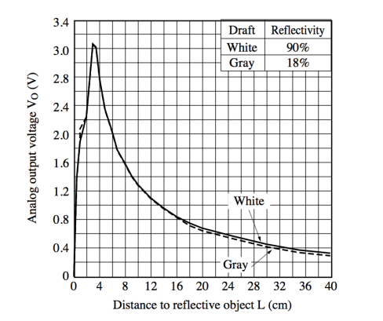
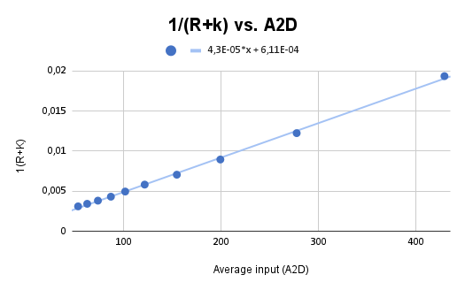
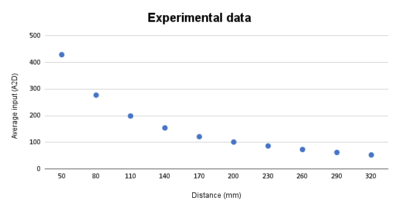

# Analog sensor reading

In this program, we explore the use of the A/D converter of the PIC16F886 for reading an analog signal from a proximity sensor that detects objects in front of the robot.

The robot used in this activity has a Sharp GP2D120 sensor mounted on its front part, capable of measuring distances from 4 cm to 30 cm, providing an analog signal as output. The image below depicts the relationship between the distance and the output voltage of the sensor.

 
 

 
<em>Relation between output voltage and distance for the Sharp GP2D120 sensor (extracted from the component's datasheet).</em> 

 

As this is a non-linear relationship, it is necessary to find an equation that can linearly convert the A/D converter value to distance.

## Calibrating the sensors 

Before finding the mentioned equation, we need to prepare the sensor for collecting data.

The program developed stays in a loop. When the key is pressed, it makes $10$ reads of the A/D converter and shows the arithmetic mean of those values on the LCD display.

The program uses a periodic interruption of Timer 0 every $5$ ms, approximately. This same interruption is used to guarantee $4$ A/D converter reads per second.

For that, Timer 0 was configured as follows:

 - **OPTION_REGbits.T0CS = 0**: Used to configure the pulse frequency. The chosen frequency was the internal one, $F_{osc}/4$, meaning one-fourth of the oscillator frequency. Since the PIC model used in the laboratory operates at a frequency of $20$ MHz, $F_{osc}/4$ is $5$ MHz.
 -  **OPTION_REGbits.PSA = 0**: This parameter determines whether the prescaler will be used by the Watchdog Timer or by Timer 0. With a value of $0$, the prescaler is reserved for Timer 0. 
 -  **OPTION_REGbits.PS = 7**: Selection of the prescaler rate. With a value of $7$ (or 0b111), the rate is configured at $1:256$, meaning $256$ pulses of $F_{osc}/4$ for $1$ output pulse from the prescaler.
 -  **TMR0 = 0xff - 98**: Initial value of Timer 0. In order to achieve the desired time between interruptions of $5$ ms, the overflow flag of Timer 0 must be triggered after only $98$ pulses, instead of $255$.

The configuration above results in a Timer 0 interruption every $5.0176$ ms, or approximately $5$ ms. In order to meet the timing requirement of the calibration program, the interrupt routine must generate $4$ proximity sensor measurements per second. In other words, the measurements should be taken at intervals of $250$ ms each:

$$\dfrac{1 \text{ second}}{4 \text{ measurements}} = 250 \text{ ms between measurements}$$

The configuration of Timer 0 results in an interruption every 5 ms, so every 50 interruptions, a measurement should be performed, resulting in 4 measurements per second:

$$\dfrac{250 \text{ ms}}{5 \text{ ms}} = 50 \text{ interruptions}$$

## Treating the collected data
For that, the approached used was based on the article [Linearizing Sharp Ranger Data](https://acroname.com/blog/linearizing-sharp-ranger-data). After collecting the experimental data, we got the following data: 

 

 
<em>Graph with the data points experimentally collected using the calibration program.</em>

 

 

 
| **Distance (mm)** |   50  |   80  |  110  |  140  |  170  |  200  |  230  |  260  |  290  |  320  |
|:-----------------:|:-----:|:-----:|:-----:|:-----:|:-----:|:-----:|:-----:|:-----:|:-----:|:-----:|
|  **Input (A2D)**  |  432  |  278  |  198  |  155  |  121  |  101  |   88  |   76  |   60  |   54  |
|                   |  425  |  278  |  199  |  154  |  121  |  102  |   85  |   72  |   64  |   52  |
|                   |  430  |  276  |  200  |  154  |  122  |  101  |   87  |   72  |   63  |   53  |
| **Average (A2D)** |  429  | 277,3 |  199  | 154,3 | 121,3 | 101,3 |  86,6 |  73,3 |  62,3 |   53  |
|    **$1/R+k$**    | 0,019 | 0,012 | 0,008 | 0,007 | 0,005 | 0,004 | 0,004 | 0,003 | 0,003 | 0,003 |

 

Using a simple mathematical program, we can find a linear approximation to the observed behaviour in the sample data collected.

 
  

 
  <em>Graph with the data points experimentally collected using the calibration program.</em>

 

  
We know that a linear function can be described as follows,
$$y= m \cdot x +b$$

With the help of the linear regression gotten from the program, we found that
$$4.3 \times 10^{-5}x + 6.11 \times 10^{-4},$$

where
$$ m = 4.3 \times 10^{-5}, \\
b = 6.11 \times 10^{-4}.$$

The desired form is

$$R = \dfrac{m'}{(V + b')}-k, $$

where $m’ = 1/m$ and $b’ = b/m$. Therefore, performing trivial calculations, we find that 
$$R = \dfrac{23256}{(V + 14)}-2$$

