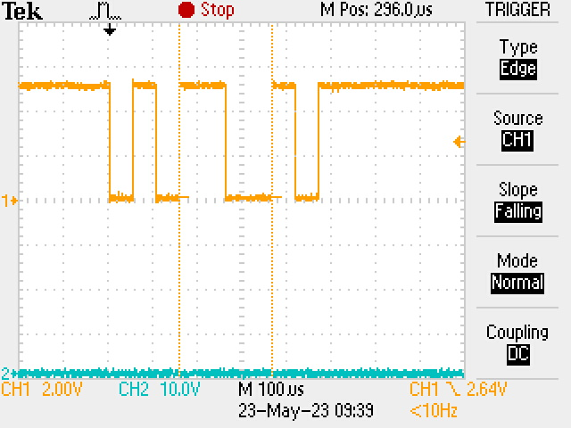

# Serial Communication 

In this project, a serial communication program was developed, and serial communication signals were analyzed with an oscilloscope.

The program exhibits the following behavior:

1. When the program starts, the LCD display should show group identification on the first line for 4 seconds, accompanied by a sound signal. After the specified time, the display should be cleared.
2. The LCD display cursor should be positioned at the first position of the first line, and a character that changes over time in the sequence 0 to 9 and A to Z should be displayed in an infinite loop. The Timer 0 interruption serves as the timing base for the interval during which each character is presented on the LCD display. The time adjustment should be controlled by a parameter in the program that determines how many Timer 0 interruptions should occur before the character changes.
3. When the button is pressed, the character currently displayed on the screen is frozen, transmitted via the serial channel to the other robot. The display cursor should advance to the next position, where the characters will start changing in sequence again.
4. The character received through the serial channel is shown on the second line of the display, starting from the first position, and so on. Each received character is presented in the next position until the line limit is reached.

## Timer 0 configuration 

The Timer 0 was configured to generate a periodic interruption every 50 ms. The bits configured in this function are:

 - **OPTION\_REGbits.T0CS = 0**: Used to configure the pulse frequency. The chosen frequency was the internal one, meaning one-fourth of the oscillator frequency. Since the PIC model used in the laboratory operates at a frequency of 20 MHz, we have
   
$$ \dfrac{F_{osc}}{4} = \dfrac{20 \text{ MHz}}{4} = 5 \text{ MHz} $$  

 - **OPTION\_REGbits.PSA = 0**: This parameter determines whether the prescaler will be used by the Watchdog Timer or Timer 0. With a value of $0$, the prescaler is reserved for Timer 0.

 - **OPTION\_REGbits.PS = 7**: Selection of the prescaler rate. With a value of $7$ (or 0b111), the rate is configured at $1:256$, meaning 256 pulses of \(F_{osc}/4\) for $1$ output pulse from the prescaler.

 - **TMR0 = 0xff - 98**: Initial value of Timer 0. In order to achieve the desired time between interruptions of $5$ ms, the overflow flag of Timer 0 must be activated after only $98$ pulses, instead of $255$.

 - **TMR0IE = 1**: This parameter enables the Timer 0 interruption.

The configuration above results in a Timer 0 interruption every $5.0176$ ms, or approximately $5$ ms. In order to meet the timing requirement of the calibration program, the interrupt routine must generate $4$ proximity sensor measurements per second. In other words, the measurements should be taken at intervals of $250$ ms each:

$$\dfrac{1  \text{ second}}{4  \text{ measurements}} = 250  \text{ ms between measurements}$$

The configuration of Timer 0 results in an interruption every 5 ms, so every 50 interruptions, a measurement should be performed, resulting in 4 measurements per second:

$$\dfrac{250  \text{ ms}}{5  \text{ ms}} = 50  \text{ interruptions}$$

## Serial communication definition 

Calculations and programming of the PIC register bits to configure the USART with a Baud rate of $19,200$ bps, with an 8-bit word length and no parity.

### Baud rate configuration

The formulas for calculating the Baud rate are presented in the table below for all possible values of the configuration bits.

 

 
<em>Formulas for calculating the Baud rate based on the configuration bits.</em>

 

The value to be programmed in the pair of SPBRGH and SPBRG registers for a Baud rate of $19200$, in asynchronous mode, with an 8-bit timer for a device with an oscillator frequency of $20$ MHz, can be calculated using the highlighted formula:

$$\text{Baud Rate} = \dfrac{F_{osc}}{16(n+1)}$$

using BRGH = 0. Solving for SPBRGH:SPBRG:

$$19200 = \dfrac{20 000 000}{16(n+1)}$$

With this, we find that $n = \frac{3077}{48}$, which is approximately $64.1$. Since the value must be an integer, we round it to $64$.

    SPBRGH = 0; // BR of 19200bps
    SPBRG = 64; // BR of 19200bps

### Configuration and operation of the asynchronous transmitter and receiver

The transmitter can be enabled for asynchronous operations by configuring the following control bits:

 - **TXEN = 1**: Enables the transmission circuit of the EUSART module.
 - **CREN = 1**: Enables the reception circuit of the EUSART module.
 - **SYNC = 0**: Configures the EUSART module for asynchronous mode operation.
 - **SPEN = 1**: Enables the EUSART module and automatically configures the RX/DT I/O pin as an input and the TX/CK I/O pin as an output.

        SPEN = 1;   // Enable serial port pins
        CREN = 1;   // Enable reception
        SYNC = 0;   // Asynchronous mode
        BRGH = 1;   // High Baud Rate
        BRG16 = 0;  // Use only 8 bits

## Wave Images

 

 
<em>Oscilloscope screen image captured in the laboratory. The observed wave corresponds to the received character 'M'.</em>

 

CH1 and CH2 indicate the scale settings of channels 1 and 2 of the oscilloscope, respectively. These values represent the maximum amplitude each channel can display. In the case of "CH1 = 2V," it means that channel 1 of the oscilloscope is set to display a signal with a maximum amplitude of 2 volts. Similarly, "CH2 = 10V" indicates that channel 2 will display a maximum amplitude of 10 volts.

The horizontal time base is the time interval that the oscilloscope represents on the horizontal axis. By setting "M = 100 µs," it means that each horizontal division on the oscilloscope represents 100 µs.

In asynchronous mode, the start of data transmission is marked by a start bit. Next, the sequence of data bits is sent, starting from the least significant bit. The transmission is terminated by a stop bit. When no data is being transmitted, the communication line remains at the same level as the stop bit, whose level is the opposite of the start bit.

The dotted area corresponds to 4 bits. Interpreting the received signals, we have "0101100101". However, the first 0 corresponds to the start bit, and the last 1 is the stop bit. Therefore, the message is 10110010. Additionally, we need to invert it since the sequence is sent starting from the least significant bit.

Finally, we have that the message is 0100 1101, which corresponds to ASCII 77, the letter 'M.'
