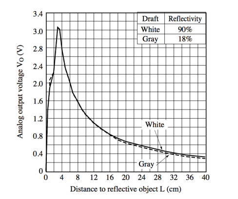

# Autonomous task 

The objective of this activity is to use the robot's sensors to perform an autonomous robotic task. With these sensors, it is possible to follow a line on the ground made with black insulating tape and avoid collisions with objects in front of the robot.

The line sensor used consists of three sets of infrared light emitter-receiver pairs, positioned side by side at the front of the robot and operating as follows: the light emitted by the emitter is reflected by the surface below and captured by the receiver. The intensity of the receiver's signal depends on the intensity of the reflected light, which, in turn, is proportional to the surface reflectivity. Darker surfaces, which absorb most of the incident light, reduce the intensity of the reflected light, while lighter surfaces reflect more light. By applying a classification threshold to the receiver's signal, i.e., a limit value for classifying a surface as light or dark, it is possible to calibrate the sensor for detecting the insulating tape that marks the track. Thus, the sensor reading can indicate the position of the insulating tape relative to the front of the cart, indicating the direction to be followed.

Additionally, a collision avoidance system has been implemented. For this purpose, the values captured by the proximity sensor reading were used, i.e., the output of the function `int sensorNear_read(void)`. The measured distance was used as a reference for adjusting the cart's speed so that if this value falls below a lower limit, the movement stops. Observing the picture below, it is noted that the output voltage increases as the distance decreases. Therefore, reading the voltage through the ADC channel results in a value between 0 and 1023 (since the converter's resolution is 10 bits), decreasing as the obstacle approaches. According to experimental results, it was observed that readings varied between approximately 500 when the obstacle was around 4 cm from the robot and 0 at greater distances.

<p align="center"> 

</p>
<p align="center"> 
<em>Relation between output voltage and distance for the Sharp GP2D120 sensor installed on the robot.</em>
</p>
<br />

The speed of the motors is determined by the duty cycle, ranging from 0 (stopped) to 55% (maximum speed limited due to battery usage). Thus, a function was created to assign the value of the subtraction between the maximum duty cycle and the ADC value to the robot's speed if the distance reading was below the safety limit of 500 (indicating an obstacle at about 4 cm), and 0 otherwise, stopping the cart until the obstacle is cleared.

Additionally, to make turns, the speed of each wheel was adjusted based on the 3-bit reading from the line sensor to keep the line aligned with the center sensor. By applying different speeds to each wheel, it was possible to perform the yaw movement necessary for the cart to adjust its trajectory according to the track. For this, a factor of 0.5 was implemented between the wheel speeds to define a satisfactory turning radius for the track.

Finally, a routine was defined to attempt to rediscover the tape in case the car lost it. In this routine, if no line was detected on the ground, the robot would initiate a circular movement until the line was detected again.


## Program Operation

In order to facilitate understanding, the main loop will be explained in parts.

### Speed
The A/D value is indirectly related to the speed, so if this value exceeds an upper limit, the movement stops. Regarding the proximity sensor reading, the value received from the function:

```c
int sensorNear_read(void)
```

can be used directly to change the robot's speed, without the need to convert this value to millimeters. This approach avoids floating-point calculations and improves performance. Depending on the implementation, this conversion can take a long time and may compromise real-time operation. The A/D value can be used directly for speed control as follows: lower A/D value increases speed, higher A/D value reduces speed, and if the A/D value exceeds an upper limit, the robot stops completely. The implementation of this behavior was carried out through the following code:
```c
sensor_distance = sensorNear_read();

if (sensor_distance >= 500) {          // if the distance is less than 4 cm
    duty_cycle = 0;                    // set speed to zero
    led_rgb_set_color(RED);            // set the LED color to red
                                       // to indicate the presence of an obstacle
} else {                               // if the distance is greater than 4 cm
    // calculate speed proportional to distance
    duty_cycle = duty_max - sensor_distance;
}
```
### Direction 
The speed of each wheel should be adjusted based on the reading of the 3 bits of the line sensor in order to keep the line aligned with the center sensor.
```c
switch (line_sensor) {  // Test the condition of the line sensor

    // If the reading is 010 or 111 (tape centered)
    case 2:
    case 7:
        pwm_set(1, duty_cycle);
        pwm_set(2, duty_cycle);  // Move forward (same speed on both motors)
        led_rgb_set_color(GREEN);  // Green LED
        LED = 0;
        break;

    // If the reading is 110 or 100 (tape to the left)
    case 6:
    case 4:
        // Turn left
        pwm_set(1, duty_cycle);
        pwm_set(2, 5 * duty_cycle / 10);  // Speed of the left wheel is 50% of
                                          // the speed of the right wheel
        led_rgb_set_color(BLUE);  // Blue LED
        LED = 0;
        break;

    // If the reading is 011 or 001 (tape to the right)
    case 3:
    case 1:
        // Turn right
        pwm_set(1, 5 * duty_cycle / 10);  // Speed of the right wheel is 50% of
                                          // the speed of the left wheel
        pwm_set(2, duty_cycle);
        led_rgb_set_color(MAGENTA);  // Magenta LED
        LED = 0;
        break;

    // If the reading is 101 (two possible paths) or 000 (lost the tape)
    default:
        pwm_set(1, 5 * duty_cycle / 10);
        pwm_set(2, duty_cycle);  // Circular movement to the right
        LED = 1;  // Turn on the warning LED
        led_rgb_set_color(BLACK);  // Turn off the multicolor LED
        break;

}  // switch
```

The `switch` statement adjusts the speed and direction of each wheel based on the 3-bit line sensor reading. The `default` case corresponds to the situation where no line is detected on the ground, and the robot should initiate a circular movement until it detects the line again.


### LED Operation 

The RGB LED changes color according to the direction in which the robot is moving. For example, it shines green if it is moving forward, blue if it is turning left, magenta if it is turning right, etc. The RGB LED is also used to signal an obstacle found in front of the robot by showing the color red.

The following function was used to control the color of the RGB LED:

```c
void led_rgb_set_color(char led_color);
```

In this function, the color of the RGB LED (including off) is set with a code between 0 and 7. The function that reads the line sensor is:

```c
int sensorLine_read(void);
```

It returns the value of the 3 bits of the line sensor as a value between 0 and 7 depending on what is detected by the sensor.

### Task status 
One of the project requirements was the ability to start/stop the task execution when requested by the user, toggling between the two states through a switch. Thus, the following code snippet was developed, which updates the operation status (`isOn` variable indicating whether the task is active or not) every time the button is pressed.

```c
keyIn = key_pressed();

if (keyIn) {            // when the button is pressed
    isOn = !isOn;       // invert the current state
    pwm_set(1, 0);
    pwm_set(2, 0);      // stop the movement

    // display the operation state on the LCD (1 if the task is running, or 0 if it is stopped)
    sprintf(sVar, "%d", isOn);
    lcd_goto(0);
    lcd_puts(sVar);
    delay_ms(150);
    lcd_goto(0);
    lcd_puts("     ");
}
```

## Results

During the completion of the activity, the developed programming demonstrated satisfactory performance in the proposed task. The robot successfully completed both the circular path and the entire circuit without deviating from the line. Additionally, when detecting an obstacle, the car was able to gradually reduce its speed until stopping at a safe distance. The LEDs exhibited the expected behavior, shining in the specified colors for each action. Finally, when placing the car outside the line, it could perform the circular movement until finding the circuit again, thus orienting itself over several iterations to continue the course.
